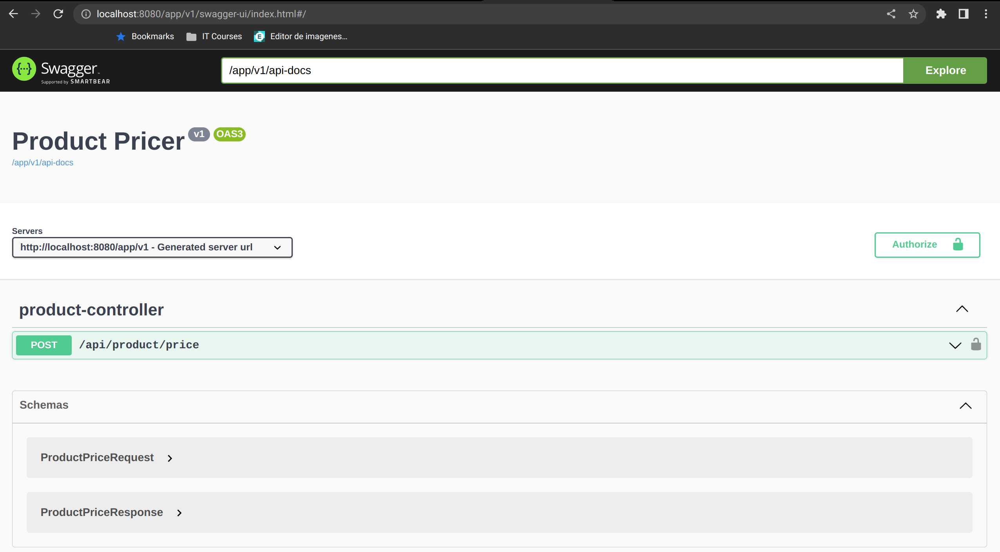
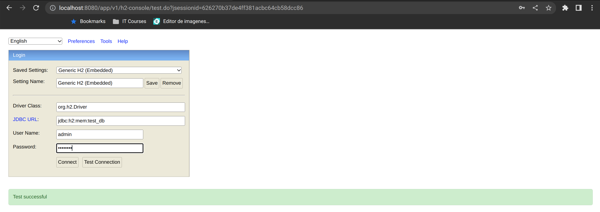
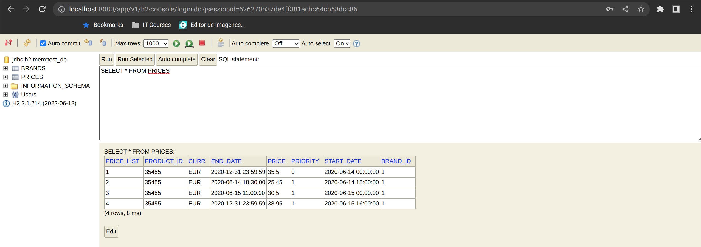

# Product Pricer Microservice using SpringBoot

Sistema precificador de producto

* Datos de entrada: fecha deseada (formato="yyyy-MM-dd-HH.mm.ss"), id de la cadena y id del producto
####
* Página para acceder a Swagger APIs:
* http://localhost:8080/app/v1/swagger-ui.html
####
* API Basic authentication:
* User: api
* Pass: Api@123
####

###
* Página para acceder a console de base de datos H2 (in-memory):
  http://localhost:8080/app/v1/h2-console
* User: admin
* Pass: Admin123
####
  
####
  

## Tecnologías utilizadas:
* Java 11
* Spring Boot
* Spring Data
* Spring REST
* Spring Security
* Springdoc (Swagger3 API)
* H2 database (in-memory)
* Lombok
* MapStruct
